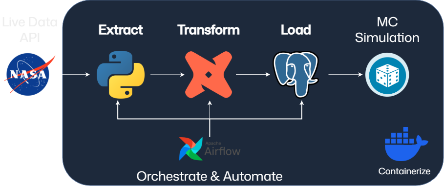
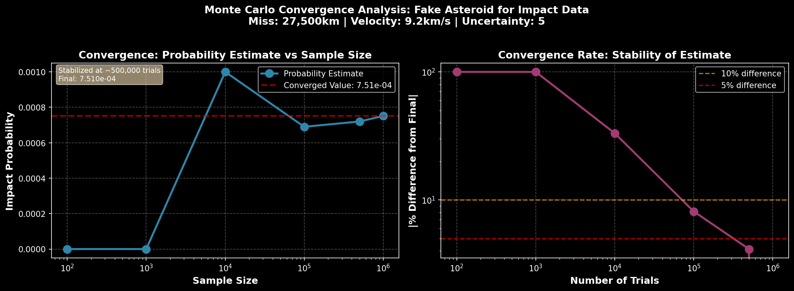

 # 🌍 NASA Near-Earth Object (NEO) Impact Risk ETL Pipeline

An end-to-end **data engineering and scientific analysis pipeline** that ingests NASA Near-Earth Object (NEO) data with Apache Airflow, stores it in PostgreSQL, transforms it with dbt, and performs **Monte Carlo simulations** to estimate asteroid impact risk.

This project demonstrates **ETL orchestration, containerized infrastructure, uncertainty modeling, and probabilistic simulation** using real NASA data.

---

## 🚀 Project Overview

**What this project does:**

1. **Extract**
   - Pulls Near-Earth Object data from NASA public APIs
   - Retrieves miss distance, velocity, orbital parameters, and uncertainty metrics

2. **Load**
   - Stores raw encounter data in PostgreSQL
   - Initializes schemas automatically on container startup

3. **Transform**
   - Uses **dbt** to clean, normalize, and model dangerous asteroid features
   - Produces analytics-ready tables for simulation and ranking

4. **Analyze**
   - Runs **Monte Carlo simulations** using NASA orbit uncertainty classes
   - Estimates impact probability with gravitational focusing
   - Computes confidence intervals and summary statistics

5. **Orchestrate**
   - Entire workflow orchestrated with **Apache Airflow 3.0**
   - dbt transformations executed via DockerOperator

6. **Containerize**
   - Services and enviornments containerized using Docker for deployment and reproducibility

---
## 🏛️ Architecture



## 🛠️ Technology Stack

| Component | Tool | Purpose |
|-----|-----|-----|
| Orchestration | Apache Airflow | Workflow scheduling & monitoring |
| Database | PostgreSQL | Data warehouse |
| Transformations | dbt (Postgres) | SQL-based transformations |
| Infrastructure | Docker Compose | Service orchestration |
| Analysis | Python, NumPy, Pandas, Matplotlib | Data ingestion, simulation & visualization |
| API | NASA Near-Earth Object APIs | NeoWs data source

---
## 🎲 Monte Carlo Impact Simulation

**The simulation estimates asteroid impact probability by:**

- Sampling miss-distance distributions
- Mapping NASA orbit uncertainty classes (0–9) to positional variance
- Applying **gravitational focusing**
- Running up to **500,000 trials per asteroid**
- Reporting:
  - Impact probability
  - 95% confidence intervals
  - Distribution statistics
  - Trial convergence analysis
 
**Input Parameters from API**:
   - Nominal miss distance
   - Velocity
   - Orbit uncertainty
  
 **Key modeling assumptions:**
- Orbit uncertainty mapped to positional variance
- Miss distance sampled from a normal distribution
- Earth impact defined using an effective radius: r_critical = R_earth × sqrt(1 + (v_escape² / v_relative²))
- Statistical uncertainty reported using the **Wilson score interval**

This is a **risk-ranking model**, not a full orbital propagator.

### **Data Query example for high risk asteroids:**
```sql
SELECT 
    neo_id,
    miss_distance_km,
    velocity_km_s,
    orbit_uncertainty,
    is_potentially_hazardous
FROM {{ ref('stg_neo_data') }}
ORDER BY
    miss_distance_km ASC,
    orbit_uncertainty DESC
LIMIT 3
# .dbt/my_project/models/mart/dangerous.sql
```
---
### **Simulation Report:**
_impact_analysis.png)

### **Convergence Analysis:**


---
## 📦 Prerequisites
-  **Docker Desktop** - [Install](https://www.docker.com/products/docker-desktop)
-  **NASA API Key** (free) - [Get yours here](https://api.nasa.gov/)
     - Rate Limits: 1,000 requests/hour with API key
     - Demo key available but limited to 30 requests/hour
---
## ⚙️ Running the Project
### Clone the Repository
```bash
git clone https://github.com/Nabisquik/NASA-API-ETL-SIM.git
cd NASA-API-ETL-SIM
```
### Configure Environment
```bash
cp .env.example .env 
cp .dbt/profiles.yml.example .dbt/profiles.yml
# edit these files for credentials
```
### Begin Services
```bash
docker-compose up
```
### Access Airflow
```txt
http://localhost:8000
```
- **Username**: `admin`
- **Password**: `in_terminal`

### Trigger the DAG & Schedule
NASA-API-dbt-Orchestrator 
  - Current trigger '@once'
  - Current date range = 1 day
      - API allows up to 7 days

### Check for inserted data
```bash
docker-compose exec db psql -U db_user -d db
```

### Stopping -  removing containers & volumes
```bash
docker-compose down -v
```
---
## 🎯 Why This Project Matters

This project bridges **data engineering** and **scientific risk modeling**, demonstrating:
- Production-style ETL orchestration
- Uncertainty-aware analytics
- Real-world API ingestion at scale
- Reproducible containerized workflows
---
## 📄 License

This project is licensed under the MIT License.


